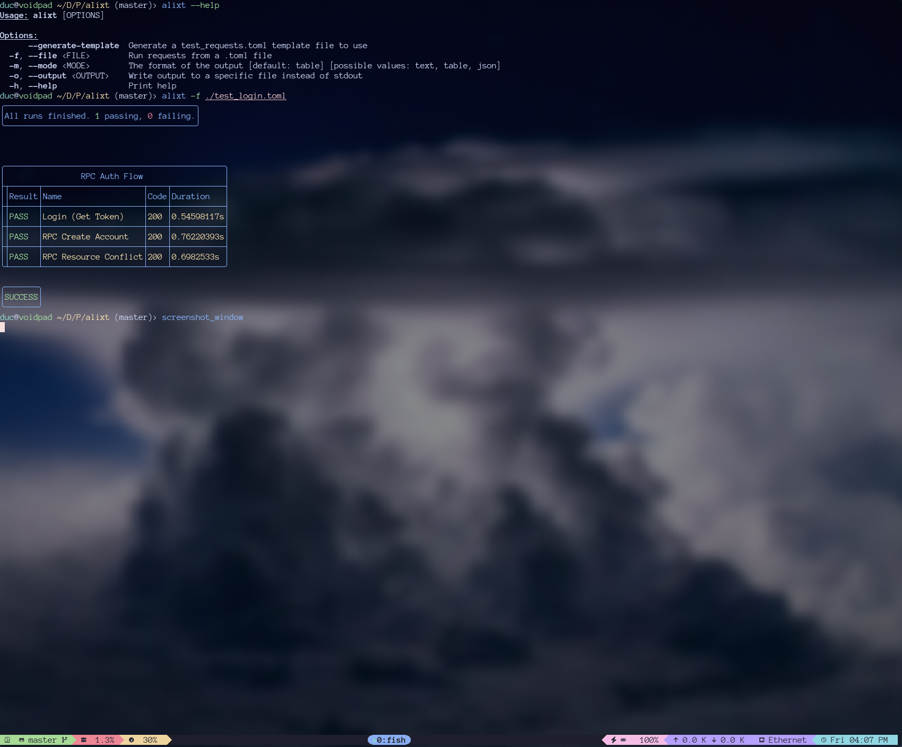

# Alixt Table

A lightweight table rendering library for CLI output, uses std::io::Write for easy intregration

## Installation
```toml
[dependencies]
alixt-table = "0.1.0"
```

## Usage
TODO

## Example Output From Alixt:


#### License

<sup>
Licensed under either of <a href="LICENSE-APACHE">Apache License, Version
2.0</a> or <a href="LICENSE-MIT">MIT license</a> at your option.
</sup>

<br>

<sub>
Unless you explicitly state otherwise, any contribution intentionally submitted
for inclusion in this crate by you, as defined in the Apache-2.0 license, shall
be dual licensed as above, without any additional terms or conditions.
</sub>
